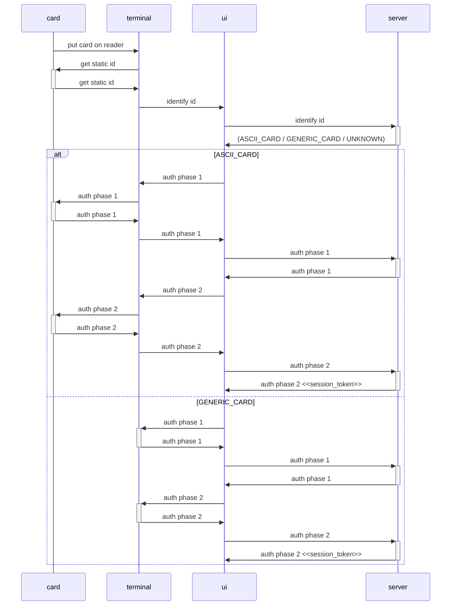

# ascii-pay-server

## Run integration tests

Integration test are based on a postman collection and executed via `newman`. All test are run within `docker`/`docker compose` so no additional dependencies are necessary.

```bash
./tests.sh

# OR

docker compose up -d postgres
cargo run
cd collections
newman run ascii-pay-tests.postman_collection.json
cd ..
docker compose down
```

## apple wallet pass setup


Requirements:
- `AppleWWDRCAG3.cer`
- `pass.cer` (from https://developer.apple.com/account/resources/certificates/list)
- `key.pem` (from CertificateSigningRequest for `pass.cer`)
  - if you have a `.p12` file after exporting the key from Keychain, the `.pem` file can be generated with:
    `openssl pkcs12 -in key.p12 -nodes -legacy -nomacver > key.pem`

```bash
openssl x509 -inform der -in AppleWWDRCAG3.cer -out apple-wwdr.pem
openssl x509 -inform der -in pass.cer -out apple-apns.pem
openssl pkcs12 -export -in pass.cer -inkey key.pem -out apple-pass.p12
```

## nfc authentication



For `GENERIC_CARD`s the terminal contains a private key to perform the challenge response process.
